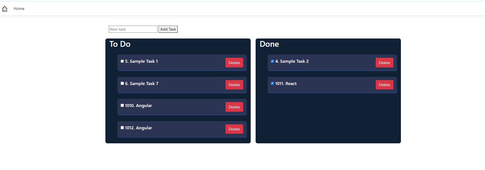

# To-Do List Tutorial Project
## Description
This is a ASP.NET project using the SQL Server database.
This implements the drag-and-drop functionality from the To-Do list to the Done list.
## Getting Started

1. Clone the repository:
    ```
    git clone https://github.com/bjmmtin/ToDoList-ASP.NET.git

2. Use Entity Framework migrations to create your database schema.
    ```
    dotnet ef migrations add InitialCreate
    dotnet ef database update

3. Run the application
    ```
    dotnet run


